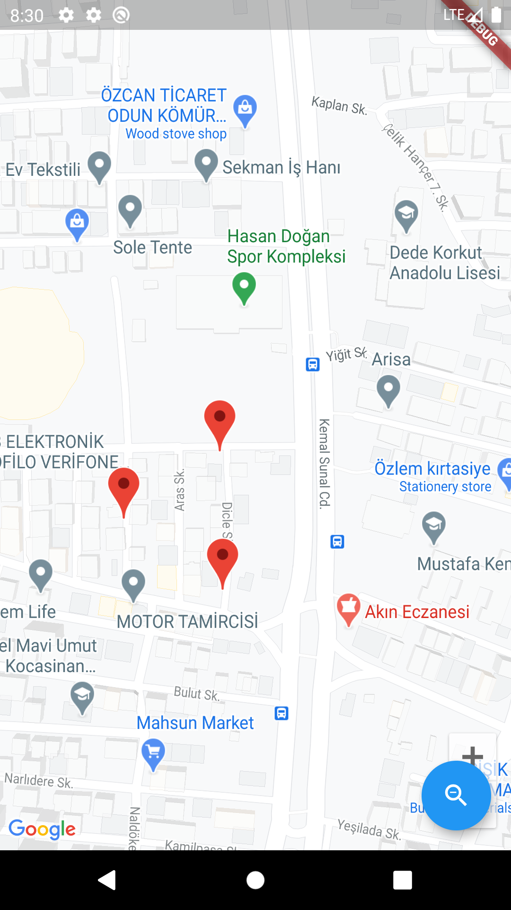
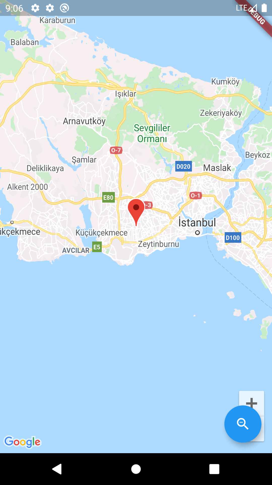

# Google Maps Marker And Camera Control in Flutter  
  
Add markers and change camera position in Google Maps.   

## Screenshots

>{ width: 90px; }
>


  
## Implementation  
  
> Add dependencies to pubspec.yaml file.  
  
<pre><code>google_maps_flutter: ^0.5.24+1</code></pre>  
>How to get API Key :  https://developers.google.com/maps/documentation/android-sdk/get-api-key  
> You have to get API key (I will explain soon) and add this code   

```xml  
<meta-data android:name="com.google.android.geo.API_KEY"  
                                   android:value="YOUR KEY HERE" /> 
```                      
> in **project/android/app/src/main/AndroidManifest.xml** file like the code below.  <br>
>How to get API Key :  https://developers.google.com/maps/documentation/android-sdk/get-api-key  
  
```xml
 <application
                   android:name="io.flutter.app.FlutterApplication"
                   android:label="flutter_maps_basics"
                   android:icon="@mipmap/ic_launcher">
           
                   <meta-data android:name="com.google.android.geo.API_KEY"
                       android:value="YOUR KEY HERE" />
                   <activity
                       android:name=".MainActivity"
                       android:launchMode="singleTop"
                       android:theme="@style/LaunchTheme"
                       android:configChanges="orientation|keyboardHidden|keyboard|screenSize|smallestScreenSize|locale|layoutDirection|fontScale|screenLayout|density|uiMode"
                       android:hardwareAccelerated="true"
                       android:windowSoftInputMode="adjustResize">
                       
```

